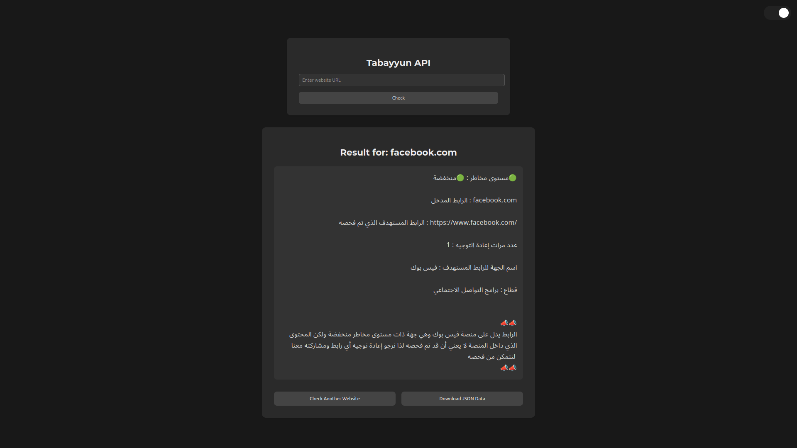

# Tabayyun API Web Interface



## How to install?

1. Install dependencies:
```bash
pip install Flask requests python-dotenv
```

2. Rename [`.env.example`](./.env.example) to `.env`, and add your [API_KEY](./.env.example#L1)

## Usage

### Web Interface

Run the Flask web application:

```bash
python app.py
```

Then open http://localhost:5000

### Command Line

Use the command-line interface for batch processing:

```bash
# check a specific website
python main.py facebook.com

# check with custom output directory
python main.py facebook.com -o results

# or simply run this, and proceed interactively
python main.py
```

## Repo Structure

```sh
├── app.py                 <- Flask web app
├── main.py                <- Command-line script
├── templates/             <- HTML templates
│   ├── base.html
│   ├── index.html
│   └── result.html
├── static/
│   ├── css/
│   │   └── style.css
│   └── js/
│       ├── app.js
│       └── result.js
├── output/
└── requirements.txt
```
